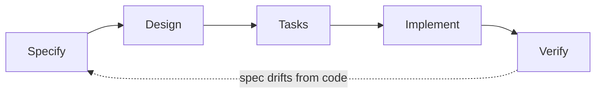

# Spec-Driven Development at FORMA

This document defines how FORMA does Spec-Driven Development (SDD): every
shipped feature has a spec folder under [`specs/`](specs/INDEX.md) that is
the source of truth for what the system does and why, kept in sync with the
code as it evolves. It also contains the retroactive baseline catalog for
every module that existed before this process was adopted (2026-09-10).

---

## 1. Project Overview

**FORMA** is an AI-coached strength-training app: a Flutter client (iOS,
Android, Web) backed by a FastAPI/PostgreSQL API. Its objective is to take a
user from "I want to get stronger" to a personalized weekly training
program, guided workout logging (including real-time, on-device camera form
coaching), and progress analytics — with an LLM in the loop for plan
personalization, not just static rule-based programming.

- **Version**: Flutter app `1.0.0+1` (`app/pubspec.yaml`); backend is
  unversioned (deployed continuously from `main`).
- **Primary languages/frameworks**: Dart 3 / Flutter (SDK `^3.11.5`);
  Python 3.12 / FastAPI.

### Tech stack

| Layer | Choice |
|---|---|
| Client state management | Riverpod (`flutter_riverpod ^2.6.1`) — `AsyncNotifier`/`Notifier` controllers, `FutureProvider`s for reads |
| Client navigation | `go_router ^17.5.0` — one `StatefulShellRoute.indexedStack` with 5 tabs (Today/Plan/Progress/Coach/Profile) |
| Client networking | `dio ^5.11.0` wrapped by a single `ApiClient` |
| Client local persistence | `flutter_secure_storage ^11.0.0` (JWT, Keychain/Keystore) + `shared_preferences ^2.5.5` (locale, fresh-install marker) |
| On-device ML | Google MediaPipe Tasks Vision Pose Landmarker, via a **hand-written native platform channel** (not a Flutter plugin) — `MediaPipeTasksVision` CocoaPod (iOS) / `com.google.mediapipe:tasks-vision` (Android), CPU delegate |
| Client i18n | `flutter_localizations` + ARB (`flutter gen-l10n`), English + Hindi |
| Client design system | Custom "Cast Iron & Chalk Dust" token system (`app/lib/core/design_system/`) — no third-party UI kit |
| Backend framework | FastAPI `0.115.6`, Uvicorn |
| Backend ORM / DB driver | SQLAlchemy `2.0.36` (async) + `asyncpg 0.30.0`, PostgreSQL |
| Backend migrations | Alembic `1.14.0` |
| Backend validation | Pydantic `2.10.4` / `pydantic-settings` |
| Backend auth | `python-jose` (JWT, HS256) + `passlib[bcrypt]` |
| Backend LLM integration | `groq 1.7.0` SDK — Groq-hosted `openai/gpt-oss-120b`, structured JSON-schema output, used for AI-personalized plan generation with a deterministic fallback |
| Testing framework | `flutter_test` (client, effectively unused — see §2); none configured on the backend |

### Environments / build variants

There are no Flutter flavors. The Flutter client's API base URL is resolved
by `Env.apiBaseUrl` (`app/lib/core/config/env.dart`): an explicit
`--dart-define=API_BASE_URL=...` wins; otherwise it defaults to
`http://10.0.2.2:8000/api/v1` on the Android emulator or
`http://localhost:8000/api/v1` everywhere else (iOS simulator, web, macOS,
and physical devices need an explicit override pointed at the host's LAN
IP). The backend has two deployment shapes: **local dev** via
`backend/docker-compose.yml` (Postgres 16-alpine + the API container) or a
bare venv, and **production** via `render.yaml` (a Render Blueprint running
the same `backend/Dockerfile` on Render's `starter` plan). Both run
`alembic upgrade head` before the server starts, so schema state and
deploy are never out of sync.

### Folder structure

```
FORMA/
  app/                          Flutter client
    lib/
      core/                     DI, networking, routing, persistence, design system, i18n
      features/                 one folder per feature (data/domain/presentation)
        auth/  onboarding/  programs/  dashboard/  workout/  camera_coach/
        progress/  achievements/  challenges/  settings/
      l10n/                     ARB source + generated localization classes
    ios/ android/ web/          platform projects
    test/                       (effectively empty — see §2)
  backend/                      FastAPI + PostgreSQL API
    app/
      api/v1/endpoints/         one router module per resource
      core/                     config.py, security.py
      db/                       session.py, base.py, seed_data.py, ai_seed.py
      models/                   SQLAlchemy models
      schemas/                  Pydantic schemas
      services/                 business logic (plan_generator, ai_plan_generator, achievements, challenges, progress, records, email_service)
    alembic/versions/           4 linear migrations
    Dockerfile  docker-compose.yml
  render.yaml                   production deploy blueprint
  specs/                        this process's spec folders (see §4)
  SPEC_DRIVEN_DEVELOPMENT.md    this file
  README.md
```

### Setup / run (condensed — see [README.md](README.md) for the full version)

```
# Backend
cd backend && docker compose up --build      # http://localhost:8000, /docs for Swagger

# App
cd app && flutter pub get && flutter run     # defaults to localhost:8000/api/v1
```

---

## 2. Why we're doing this

Writing the retroactive baseline (§11) surfaced exactly the kind of risk
SDD exists to catch — behavior that only lives in code, comments, and one
engineer's memory, with nothing structured tying it together:

- **The AI-vs-deterministic plan generator has a silent-failure design by
  construction.** `ai_plan_generator.generate_program_smart`
  (module [003](specs/003-programs-plan-exercises/design.md)) tries an LLM
  call and falls back to a rule-based generator on *any* exception — Groq
  outage, malformed JSON, an injury-safety violation. That's the right
  design for an onboarding-critical endpoint, but there is zero automated
  test exercising the fallback itself, and the one signal that would tell a
  user which path they got (`Program.source`) is parsed into the client
  model and never displayed anywhere. A future refactor could break the
  fallback silently and nothing would fail loudly.
- **A previously-real production bug (the empty-dashboard race) is now
  prevented only by an ordering convention spread across two files** —
  `step9_building.dart` generating the plan before flipping
  `onboarding_completed`, and a matching guard in `app_router.dart`'s
  redirect chain. The router file's own inline comments document several
  other bespoke exceptions added to fix earlier regressions of the same
  shape (module [013](specs/013-engineering-infrastructure/design.md)).
  Without a spec recording *why* that ordering and that guard exist, the
  next engineer touching either file has no way to know they're load-bearing.
- **There is effectively zero automated test coverage anywhere in the
  repository** — one Flutter widget test that currently cannot pass
  (asserts text that doesn't exist, against a route the app never reaches),
  and no backend test suite at all. Every module's `design.md` states this
  plainly rather than letting it go unnoticed; specs are the only
  regression-relevant documentation this codebase currently has.
- **A live security-relevant misconfiguration** (wildcard CORS +
  `allow_credentials=True`, committed in `render.yaml`, module 013) would
  have been easy to miss in a normal code review of any single PR, because
  no single diff touches both `main.py` and `render.yaml` together — it
  only became visible by deliberately documenting the networking layer as
  a whole.

SDD's job here isn't process for its own sake — it's making sure the *next*
change to plan generation, onboarding routing, or auth doesn't have to
rediscover any of this the hard way.

---

## 3. The lifecycle



1. **Specify** — write `requirements.md`: summary, background, user
   stories, EARS acceptance criteria, explicit out-of-scope, non-functional
   requirements, open questions. Get it reviewed before design starts.
2. **Design** — write `design.md`: approach, architecture/data flow (real
   file paths once code exists), data/schema, alternatives considered,
   testing strategy, risks. Get it reviewed before tasks are cut.
3. **Tasks** — write `tasks.md`: a numbered, sequenced task list derived
   directly from the design, small enough to implement and verify
   incrementally.
4. **Implement** — write the code against the design. If reality forces a
   deviation from the design, update `design.md` in the same PR — don't
   let the doc silently go stale (see §9).
5. **Verify** — walk the acceptance criteria against the shipped behavior
   (manually or with tests), reconcile the Backlog/Known Gaps list, and
   flip `Status` to `Approved`.

---

## 4. Repository layout

Every module — retroactive or new — gets `specs/NNN-module-slug/`:

```
specs/
  001-auth-identity/
  002-onboarding/
  ...
  013-engineering-infrastructure/
  INDEX.md
```

- **001–013 are the retroactive baseline**, written 2026-09-10, documenting
  FORMA's app + backend as they existed at that date. Each has
  `requirements.md` + `design.md` only — no `tasks.md`, because there is no
  task list for already-shipped work.
- **New work starts at 014.** The next module to go through the full
  lifecycle gets `specs/014-<slug>/`, with `requirements.md`, `design.md`,
  *and* `tasks.md`.
- Numbers are never reused and folders are never deleted, even once a
  feature is superseded or removed — see §8.

---

## 5. Templates

### `requirements.md`

```markdown
Status: Draft | In Review | Approved
Owner: <name>
Related: <links to design.md, tasks.md, issues>

## Summary
## Background / Problem
## User Stories
## Acceptance Criteria (EARS format: "WHEN/IF ... THE SYSTEM SHALL ...")
## Out of Scope
## Non-Functional Requirements
## Open Questions
```

### `design.md`

```markdown
Status: Draft | In Review | Approved
Owner: <name>
Related: <links to requirements.md, tasks.md, issues>

## Approach
## Architecture / Data Flow
## Data / Schema
## Alternatives Considered
## Testing Strategy
## Risks / Edge Cases
## Backlog / Known Gaps
```

### `tasks.md`

```markdown
Status: Draft | In Progress | Done
Owner: <name>
Related: <links to requirements.md, design.md>

## Task List
- [ ] 1. <task> — <file(s)/area>
- [ ] 2. <task> — <file(s)/area>
...

## Sequencing / Dependencies
<which tasks block which>

## Definition of Done
<what "done" means for this task list — tests passing, acceptance
criteria walked, docs updated, etc.>
```

---

## 6. Writing guidance

**Good requirements** are falsifiable and specific. "WHEN a user submits
valid credentials, THE SYSTEM SHALL issue a JWT and persist it to secure
storage" is checkable; "the app should handle login well" is not. Every
acceptance criterion should be traceable to either a test or a specific
code path once implemented — write them as if you'll grep for the file:line
that satisfies each one later, because during verification (§10) you will.

**Good design docs** cite real things: file paths, class/function names,
an actual call-chain trace, not a paraphrase of the architecture in the
abstract. If a design doc could be written without looking at any code,
it's not detailed enough to be useful during implementation or during a
future verify pass. State trade-offs explicitly in "Alternatives
Considered" — the reason a simpler approach was rejected is often the most
valuable sentence in the document six months later.

**Breaking down tasks**: a task should be small enough that its diff is
reviewable in one sitting and its own acceptance slice is independently
verifiable. Sequence tasks so that each one leaves the system in a
working (if incomplete) state — avoid a task list that only compiles/works
after the last item lands. Call out cross-module dependencies explicitly
in "Sequencing / Dependencies" rather than leaving them implicit in task
order.

---

## 7. When a spec is required

| Change type | Spec required? |
|---|---|
| One-line bug fix | No |
| New feature | Yes — full lifecycle |
| Behavior change to sensitive/critical logic (auth, payments/IAP, plan generation, migrations) | **Yes, even if the diff is small** |
| Refactor with no behavior change | `design.md` only (update the existing one if the module already has a spec) |
| Schema / data migration | **Always yes** |
| Copy/UI-only tweak with no logic change | No |
| Dependency version bump with no behavior change | No |

When in doubt, write the spec — the cost of a short unnecessary
`requirements.md` is far lower than the cost of an undocumented change to
logic like `generate_program_smart`'s AI fallback or the router's redirect
chain, both of which have already caused real regressions once (§2).

---

## 8. Status and change management

- Specs are kept **in sync with shipped behavior**, not with original
  intent. If a PR changes behavior a spec describes, that PR updates the
  spec in the same change — a stale spec is worse than no spec, because it
  actively misleads.
- **Never delete a completed module's spec folder**, even after the
  feature is removed or replaced. Mark it superseded (`Status: Superseded
  by 0NN-...`) and leave it in place — it's the historical record of why
  something was built the way it was.
- A module's `Status` line is the single source of truth for its
  freshness: `Draft` → `In Review` → `Approved` → (optionally)
  `Superseded`. Retroactive baseline modules carry
  `Approved (Retroactive Baseline — documents behavior as implemented,
  dated <date>)` until the first real change to that module updates them
  to a normal `Approved` status reflecting the new content.

---

## 9. Working with AI coding agents under this process

Point an agent at the relevant `design.md`/`tasks.md` instead of
re-describing the feature in the prompt every time — the spec already has
the file paths, the call-chain trace, and the reasoning an agent needs, and
re-explaining it in chat drifts from what's on disk. If an agent's
implementation needs to deviate from the design (a documented approach
turns out not to work, an API shape has to change), have it **update
`design.md` to match reality in the same change**, not silently improvise
and leave the doc wrong — a design doc that lies is worse than a missing
one. When asking an agent to verify or extend an existing module, give it
the module's spec folder path directly rather than asking it to
rediscover the architecture from source.

---

## 10. How to verify a module

1. **Requirements match code**: re-read each acceptance criterion in
   `requirements.md` against the current implementation — does the cited
   file:line still do what's claimed?
2. **Architecture description matches code**: re-walk `design.md`'s
   Architecture/Data Flow trace — has a refactor moved logic without the
   doc being updated?
3. **Walk the flow(s)**: manually exercise each numbered flow in §11 (or
   run the tests, if any exist for that module), not just the happy path.
4. **Reconcile the Backlog list**: for each item in `design.md`'s
   Backlog/Known Gaps, confirm it's still true, still relevant, and still
   unfixed — remove items that were since fixed, add anything newly found.
5. **Update Status**: flip to `Approved` (with today's date if it's a
   retroactive baseline being re-verified) once 1–4 check out; otherwise
   leave it `In Review` and note what's outstanding.

---

## 11. Complete Module Catalog

All 13 modules below are **Retroactive Baseline** specs
(`Status: Approved (Retroactive Baseline — documents behavior as
implemented, dated 2026-09-10)`). Each subsection is a condensed summary —
the linked spec folder is the unabridged source of truth. See also
[specs/INDEX.md](specs/INDEX.md) for the one-line catalog and the full list
of notable findings across all modules.

### 001 — Auth & Identity
[requirements.md](specs/001-auth-identity/requirements.md) · [design.md](specs/001-auth-identity/design.md)

Registration, email/password login, JWT session persistence, logout,
password reset, and in-app change-password/change-email. No social sign-in
exists (verified absent, not just unbuilt).

**Flows:**
1. **Registration** → `POST /auth/register` (bcrypt-hash, no server-side
   length check) → auto-login.
2. **Login** → `POST /auth/login` (OAuth2 password form) → JWT →
   `flutter_secure_storage` → `GET /users/me` → router redirects to
   `/today` or `/onboarding`.
3. **Session restore on launch** → `clearStaleTokenOnFreshInstall()` (guards
   against Keychain tokens surviving app deletion) → stored-token check →
   `GET /users/me` validates or clears.
4. **Password reset** → request (generic response regardless of account
   existence) → 32-byte token, SHA-256 hash + 30min expiry stored on `User`
   → email logged (no SMTP configured) and echoed as `debug_token` in dev
   mode → confirm (token + new password ≥8 chars) → password updated.

**Selected EARS requirements:** registration auto-logs in on success;
password-reset-confirm and change-password both enforce an 8-char minimum
server-side (registration does not); a 401 anywhere clears the token and
signs the user out reactively.

**Architecture:** `AuthController` (Riverpod `AsyncNotifier<User?>`) is the
single source of truth for signed-in state; `go_router`'s `redirect`
watches it via a `ChangeNotifier` bridge. Backend: bcrypt + HS256 JWT,
`get_current_user` dependency decodes on every protected request.

**Data:** `users` table carries auth fields inline (no separate
sessions/tokens table — the JWT itself is the session). Password-reset
token hash + expiry are two nullable columns on `User`.

**Testing:** No automated coverage. The one existing Flutter test
(`widget_test.dart`) asserts text/routing that doesn't match current
behavior and cannot pass.

**Known gaps:** dead `UserLogin` schema; no server-side password-length
validation on registration; `secret_key` defaults to a literal placeholder.

---

### 002 — Onboarding
[requirements.md](specs/002-onboarding/requirements.md) · [design.md](specs/002-onboarding/design.md)

The 9-step post-signup quiz (goal, experience, stats, location/equipment,
frequency, split, injuries) that generates the user's first program before
handing off to the main app.

**Flows:**
1. **Main quiz-to-plan flow**: steps 1–8 write to an in-memory
   `OnboardingController` → step 9 (`Step9Building`) calls
   `POST /programs/generate` **first**, then sets
   `onboardingPostFlowActiveProvider = true`, then `PATCH /onboarding`
   (flips `onboarding_completed`) — this exact order, plus a router guard
   checking the flag, is what prevents a previously-real bug (landing on an
   empty dashboard because onboarding completed before a plan existed) →
   plan preview → save-plan screen → `/today`.
2. **Edit-a-prior-answer flow**: tapping a row on the review step (`Step8Review`)
   jumps the `PageView` back to that step for editing, then forward again.

**Selected EARS requirements:** Continue is disabled until required fields
are set per step; changing days/week resets an incompatible split
preference to `'auto'`; plan generation must complete before
`onboarding_completed` is set to `true`.

**Architecture:** one `PageView` of 10 widgets over one in-memory
`Notifier<OnboardingAnswers>`; nothing is sent to the backend until step 9.

**Data:** client-side `OnboardingAnswers` → `toOnboardingPayload()` →
backend `OnboardingUpdate` (blanket `setattr`, effectively a full replace
of onboarding columns).

**Testing:** No automated coverage on either side.

**Known gaps:** quiz progress is held only in memory (an app kill mid-quiz
loses everything); split/day-compatibility rules are duplicated in two
files with no shared source of truth.

---

### 003 — Programs, Plan & Exercises
[requirements.md](specs/003-programs-plan-exercises/requirements.md) · [design.md](specs/003-programs-plan-exercises/design.md)

The core training domain: `Program`/`ProgramDay`/`ProgramExercise`, the
47-exercise curated catalog, and the two program-generation paths.

**Flows:**
1. **Program generation**: `generate_program_smart` — if `GROQ_API_KEY` is
   unset, calls the deterministic generator directly; otherwise tries the
   AI path (Groq `openai/gpt-oss-120b`, JSON-schema-constrained,
   deterministic injury-avoidance backstop applied regardless of what the
   LLM did) and, on **any** exception, rolls back and falls back to the
   deterministic generator — the request always succeeds.
2. **Day-editor flow**: rename day and add/remove muscle tag both ride the
   same generic `PATCH /programs/days/{day_id}`; "Let AI fill this day"
   calls a **dedicated but non-AI** endpoint (`POST .../fill`) that reuses
   the deterministic `select_exercises_for_day` heuristic — zero LLM calls
   despite the UI's "✨ Let AI fill this day" copy.

**Selected EARS requirements:** a program is tagged `source = "generated"`
or `"ai_generated"`; an AI-day-count mismatch or an injury-avoidance
violation forces the deterministic fallback; fill-day only appends,
never replaces.

**Architecture:** one deterministic skeleton builder
(`_resolve_split`/`_build_day_plans`) consumed by three call sites — the
pure generator, the AI generator (fills exercises via LLM constrained to
that skeleton), and fill-day (reuses the skeleton logic directly against an
existing day).

**Data:** `Program` → `ProgramDay` → `ProgramExercise` (cascade
delete-orphan) → references shared `Exercise` catalog rows.
Manually-edited exercise fields have no server-side numeric bounds (unlike
the AI-generation schema, which does).

**Testing:** No automated coverage — notable given the silent-fallback
design (§2).

**Known gaps:** `Program.source` is parsed but never shown to the user;
"Let AI fill this day" doesn't call AI; `ai_plan_generator` reaches into
`plan_generator`'s underscore-prefixed "private" functions.

---

### 004 — Dashboard / Today
[requirements.md](specs/004-dashboard-today/requirements.md) · [design.md](specs/004-dashboard-today/design.md)

The Today tab — the app's home screen. Small (2 files), purely an
aggregator with no schema of its own.

**Flow:**
1. **Load Today**: `TodayController` composes `activeProgramControllerProvider`
   (Programs) + `listSessions(limit: 30)` (Workout) + `recoveryProvider`
   (Progress, best-effort — a failure here doesn't block the rest of the
   screen) → derives today's `ProgramDay` by weekday match → renders
   workout-day card, rest-day card, or no-program empty state, plus a
   client-computed weekly streak/volume/form strip from the 30 loaded
   sessions.

**Selected EARS requirements:** a recovery-fetch failure must not block
the rest of the dashboard; the screen watches the shared active-program
provider so a regenerate triggered elsewhere is reflected automatically.

**Architecture:** thin presentation layer over one aggregate
`AsyncNotifier`; no independent cache, so it can't go stale relative to
the modules it reads from.

**Testing:** No automated coverage.

**Known gaps:** notification bell is a no-op; "10-MIN MOBILITY" is a
permanent "Coming soon." snackbar; streak/volume stats only look at the
last 30 fetched sessions.

---

### 005 — Workout Tracking
[requirements.md](specs/005-workout-tracking/requirements.md) · [design.md](specs/005-workout-tracking/design.md)

Active-session set logging — manual entry and camera-coached entry, both
converging on the same backend write path.

**Flows:**
1. **Manual set-logging**: start session (from a program day or freestyle)
   → tap a set row → keypad entry (weight/reps/type, plate-math for
   barbells) → "LOG SET" → `POST /workouts/sessions/{id}/sets` → PR check
   (Epley 1RM vs. best) → rest timer → repeat → finish (XP awarded,
   achievements re-evaluated).
2. **Camera-coached set-logging**: "COACH SET" → framing precheck (module
   006's engine, lighter use) → live tracking overlay (module 006's full
   engine) → "FINISH SET" returns a `LiveSetResult` that **prefills, but
   does not submit**, the same editable set row → lifter still taps "LOG
   SET" to actually persist it — the camera flow never calls the workout
   API directly.

**Selected EARS requirements:** a barbell target weight below the bar
weight clamps the plate remainder to zero rather than going negative; a
finished session's `avg_form_score` averages every logged set's
`form_score`; camera permission denial falls back to manual logging rather
than blocking the workout.

**Data:** `WorkoutSession` → `WorkoutSet` (cascade delete-orphan);
`PersonalRecord` written by `services/records.py` on any set logged with
weight + reps.

**Testing:** No automated coverage.

**Known gaps:** per-set RPE exists end-to-end in the schema but the UI
never populates it (only session-level RPE is reachable);
`programExerciseId` is threaded through to the precheck screen but not yet
read there (a documented, intentional not-yet-wired hook).

---

### 006 — Camera Coach
[requirements.md](specs/006-camera-coach/requirements.md) · [design.md](specs/006-camera-coach/design.md)

The on-device, camera-only pose-detection/rep-counting/form-scoring/voice-
coaching engine. No backend component at all — verified absent.

**Flow:**
1. **Real-time coaching pipeline**: camera frame → native MediaPipe
   pose-landmarker call (platform channel; Android must lossily re-encode
   nv21→JPEG→Bitmap first, iOS does zero-copy) → `JointAngles` extraction →
   fed to both `FormHeuristics` (hand-authored per-movement-pattern ideal
   ranges, weighted linear penalty scoring) and `RepCounter` (two-threshold
   hysteresis state machine) → skeleton overlay + spoken cues
   (verbosity-rate-limited `flutter_tts`) → on "FINISH SET", a
   `LiveSetResult` is handed back to module 005 — this module never writes
   to any API.

**Selected EARS requirements:** a dropped/unrecognized frame is skipped,
never crashes; a rep only counts on a full bottom-to-top threshold
crossing with ≥15° excursion; form scoring and rep counting are explicitly
heuristic, not ML-classifier-based.

**Architecture:** `RepCounter`/`FormHeuristics` are deliberately pure Dart
with no camera/pose imports, built specifically to be unit-testable.

**Testing:** No automated coverage — notable specifically here because the
testability was designed in and never used; there's also no ground-truth
fixture data to validate heuristic accuracy against.

**Known gaps:** stale `ios/Podfile` comment cites `google_mlkit_commons`,
a dependency that no longer exists (leftover from a pre-MediaPipe
prototype); computed rep tempo fields are never read anywhere.

---

### 007 — Progress Analytics
[requirements.md](specs/007-progress-analytics/requirements.md) · [design.md](specs/007-progress-analytics/design.md)

Read-only analytics: a hub screen plus detail screens for volume,
recovery, form quality (Pro-gated), and consistency, all computed on read
from `WorkoutSession`/`WorkoutSet`/`PersonalRecord` — nothing is
pre-aggregated.

**Flows:**
1. **Hub load**: `ProgressHubScreen` independently fetches
   summary/volume/recovery/records/consistency per row-link, each with its
   own loading/error state.
2. **Recovery detail**: `GET /progress/recovery` always returns exactly 10
   fixed muscle groups (never empty, even for a brand-new account) —
   untrained muscles default to 100% recovered; the hub correctly special-
   cases "Fully recovered" instead of naming a muscle when everything is
   already at 100%.

**Selected EARS requirements:** a volume bucket flagged `is_deload` when
its total is less than half the preceding bucket's; Form Quality returns
HTTP 402 for non-Pro users; recovery percentage is
`min(100, hours_since_trained / recovery_window_hours * 100)` per a
fixed per-muscle window.

**Data:** reads `WorkoutSession`/`WorkoutSet`/`PersonalRecord`. The
`BodyMetric` model/table exists in the schema with **zero consumers
anywhere** — body-weight-history tracking is modeled but unimplemented.

**Testing:** No automated coverage.

**Known gaps:** `BodyMetric` is dead schema; two different "fully
recovered" thresholds (`>=100` vs. `>=85`) used in adjacent screens; two
independent Pro-gating mechanisms (client-side check on the hub, server
402 on the detail screen) that could drift.

---

### 008 — Achievements & Profile
[requirements.md](specs/008-achievements/requirements.md) · [design.md](specs/008-achievements/design.md)

A 16-achievement seeded catalog with server-computed per-user progress,
plus the Profile tab that hosts it (and links out to Settings, Challenges,
and the Coach tab, owned by other modules).

**Flows:**
1. **Achievement evaluation**: triggered at exactly two points — every
   `POST /sessions/{id}/finish` (event-driven), and once lazily for a
   brand-new user's first `GET /achievements` (seeds the initial 16 rows).
   A returning user's `GET /achievements` is otherwise a plain read, not a
   recompute.
2. **Profile screen load**: assembles avatar/name/level (client-invented
   XP formula, no backend counterpart) + a 2×2 lifetime-stat grid (summed
   client-side from up to 100 recent sessions) + recent badges + a nav list
   to Achievements/Level/Streak/Challenges/Coach/Settings.

**Selected EARS requirements:** an unlock (`unlocked_at` set) is
permanent — never cleared even if the underlying stat later regresses;
locked `is_secret` achievements display `'???'` in place of their title.

**Data:** `achievements` (global catalog) + `user_achievements` (per-user
progress, upserted on evaluation).

**Testing:** No automated coverage.

**Known gaps:** leveling/XP is entirely client-invented with no backend
formula; the one seeded "secret" achievement's real title is literally
`"???"`, so unlocking it reveals nothing; Profile's PR-count stat tile
(deduplicated) diverges from the count actually driving the `pr_hunter`/
`pr_machine` achievements (every PR event).

---

### 009 — Challenges
[requirements.md](specs/009-challenges/requirements.md) · [design.md](specs/009-challenges/design.md)

Six seeded weekly/monthly/ongoing challenges with explicit join/leave and
a leaderboard, modeled directly on the achievements pattern (verified via
the model's own docstring and a shared `compute_streak_days` import).

**Flows:**
1. **Join / leave**: `POST .../join` creates a `UserChallenge` row (or
   refreshes an existing one); `POST .../leave` **deletes** the row
   outright — no soft-leave, progress is discarded.
2. **Progress / leaderboard**: recomputed from scratch on *every*
   `GET /challenges`, `join`, and `leaderboard` call — there is no caching
   and no event trigger (unlike achievements, which recompute on
   workout-finish).

**Selected EARS requirements:** `session_count`/`volume_kg` metrics are
windowed to the current week/month, computed against the **current** time,
not the joined `period_start`; `streak_days` ignores the window entirely;
`completed_at` is set once and never cleared.

**Data:** `challenges` (global) + `user_challenges` (per-user, no unique
constraint on `(user_id, challenge_id)`).

**Testing:** No automated coverage.

**Known gaps:** `period_start` is effectively write-only (progress always
tracks the live current period); `completed_at` never resets on period
rollover, so "completed" styling can persist while the progress bar shows
a lower, current value; leaderboard has no pagination and isn't
server-side gated by `is_group`.

---

### 010 — Settings, Profile & Premium
[requirements.md](specs/010-settings-profile-premium/requirements.md) · [design.md](specs/010-settings-profile-premium/design.md)

Settings screen (training-profile editors, notification prefs, camera/
privacy, rest timer, units, language entry point, account actions), Voice
Coach settings, and the Premium/IAP paywall screen.

**Flows:**
1. **Notification preferences**: toggled locally → Save → `PATCH /users/me`
   `notification_prefs` (JSONB) — storage only; no FCM/APNs exists
   anywhere, and the sheet's own copy says so honestly.
2. **Voice-coach settings**: most controls persist immediately on change;
   the volume slider debounces to `onChangeEnd` only.
3. **Premium/IAP**: "Start trial" calls the real `in_app_purchase`
   plugin's `isAvailable()`; on this build it's always unavailable (no
   product IDs configured), so it stops at an honest "not available yet"
   dialog — the purchase call itself was never written ("plumbing left
   ready rather than faked," per the code's own comment).

**Selected EARS requirements:** training-profile edits reuse the
onboarding partial-update endpoint (`PATCH /onboarding` /
`OnboardingUpdate`, `exclude_unset=True`); the voice picker persists a
choice that never changes what `flutter_tts` actually speaks.

**Data:** `notification_prefs`, `voice_coach` (both free-form JSONB, no
server-side shape validation), `rest_timer_default_s`, `subscription_tier`
(stuck at `"free"` — no writer exists anywhere) on `User`.

**Testing:** No automated coverage.

**Known gaps:** no server-side entitlement writer for `subscription_tier`;
IAP's happy path (if a store product were ever configured) currently
falls through with no purchase call and no user feedback.

---

### 011 — Localization / i18n
[requirements.md](specs/011-localization-i18n/requirements.md) · [design.md](specs/011-localization-i18n/design.md)

English/Hindi ARB-based i18n via `flutter gen-l10n`, deliberately bounded
to intro, auth, onboarding, the tab bar, and Settings' labels (63 keys) —
empirically verified, not assumed.

**Flow:**
1. **Locale switch**: `LanguageScreen` → `LocaleController.setLocale` sets
   in-memory state (immediate app-wide rebuild) + writes `SharedPreferences`
   → best-effort `PATCH /users/me` `locale` (failure is swallowed, doesn't
   revert the local switch).

**Selected EARS requirements:** all 7 dashboard/workout/camera_coach/
programs/progress/achievements/challenges feature areas render fixed
English regardless of locale, because they never call `AppLocalizations`.

**Data:** `users.locale` column, written on every selection.

**Testing:** No automated coverage.

**Known gaps — the one genuinely new bug found in this baseline pass**:
locale sync is **one-directional**. The backend value is written on
selection but never read back into `LocaleController` on login/app
restart on a different device, directly contradicting
`LocaleController`'s own doc comment claiming it "follows the user across
devices."

---

### 012 — Uploads / Media
[requirements.md](specs/012-uploads-media/requirements.md) · [design.md](specs/012-uploads-media/design.md)

A generic, fully-built, mounted `POST /api/v1/uploads` endpoint with
**zero callers anywhere in the current Flutter client** — confirmed dead
code, most likely a leftover from the pre-pivot "memory-keeping" app.

**Flow (technical contract, currently unreached):**
1. Authenticated client POSTs a JPEG/PNG/WebP file (≤10MB) →
   content-type/size validated → stored on local disk with a UUID filename
   → returns `{"url": "/static/uploads/<uuid>.<ext>"}`, publicly readable
   with no further auth.

**Testing:** No automated coverage (nor any real usage to test).

**Known gaps:** genuinely dead code — `image_picker` is a declared but
unused pubspec dependency; the only file in `backend/static/uploads/` is a
4×4px test PNG, untracked by git.

---

### 013 — Engineering Infrastructure
[requirements.md](specs/013-engineering-infrastructure/requirements.md) · [design.md](specs/013-engineering-infrastructure/design.md)

*Architecture reference, not a user-facing module.* Covers what every
other module is built on: DI/state management, networking, routing,
persistence, the design system, backend core config/security, the DB
layer, and deployment.

**Key traces:**
1. **Request lifecycle**: `ApiClient`'s interceptor attaches the stored
   JWT to every request; a 401 anywhere clears the token and calls
   `onUnauthorized`, which `AuthController` wires to sign the user out
   reactively — one mechanism, used by every feature module.
2. **Router redirect chain**: an ordered if-chain in `app_router.dart`
   with several bespoke exceptions, each documented inline as a fix for a
   specific prior regression (the loading-state passthrough, the
   onboarding post-flow guard) — dense but correct as implemented.
3. **Deploy**: `alembic upgrade head && uvicorn ...` runs on every
   container start, local and production, so schema and code are never
   deployed out of sync.

**Selected EARS requirements:** the app ships one dark-only `AppTheme`; the
FastAPI app attaches `CORSMiddleware` from `settings.cors_origins`
(defaults to `["*"]`) with `allow_credentials=True`.

**Testing:** No automated backend tests, no CI pipeline (`.github/workflows/`
does not exist) — this applies uniformly across every module in this
catalog.

**Known gaps — security-relevant, live, not hypothetical:** wildcard CORS
origins combined with `allow_credentials=True` (in both the code default
and the committed `render.yaml`) means any origin can currently make
credentialed requests against the deployed API; `Settings.secret_key`
defaults to a literal placeholder string with no startup check forcing a
real value; there is no refresh-token or revocation mechanism.
